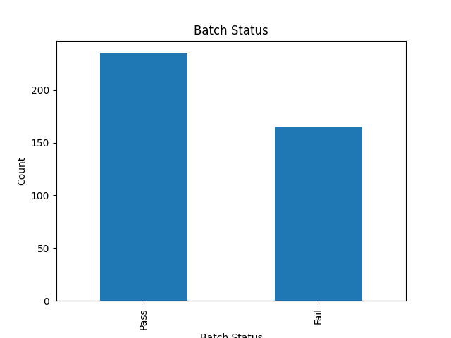
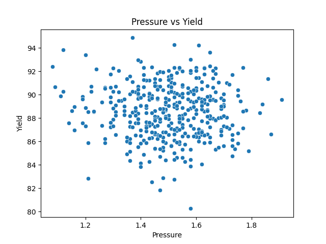
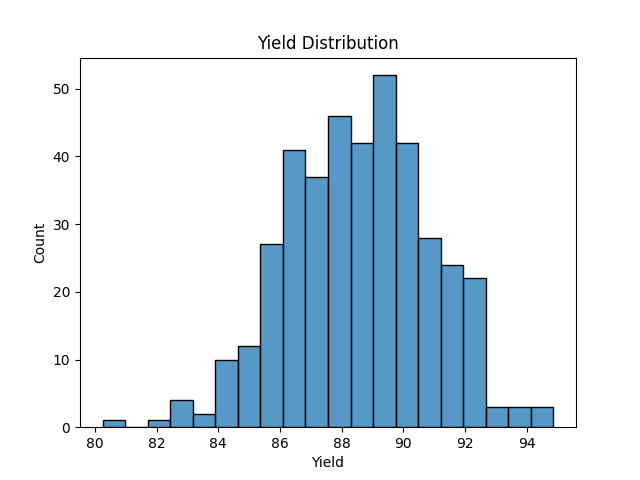

⭐# CMC AI Data Platform for Biopharma Manufacturing

Building AI‑ready CMC data products for predictive quality, batch intelligence, and process optimization in biopharmaceutical manufacturing.

---

## 📌 Project Overview

Chemistry, Manufacturing and Controls (CMC) data in biopharma is typically fragmented across multiple systems:

- **LIMS** – analytical test results  
- **MES** – batch manufacturing records  
- **ELN** – experimental development data  
- **PAT sensors** – real‑time process signals  

Because these datasets are heterogeneous and siloed, it is difficult to build AI/ML models for:

- Predictive quality analytics  
- Batch failure prediction  
- Process anomaly detection  
- Yield optimization  
- Real‑time manufacturing insights  

This project demonstrates how to build an AI‑ready CMC data platform** that unifies manufacturing, analytical, and sensor data into standardized data products for advanced analytics and machine learning.

The goal is to simulate a real‑world pharmaceutical CMC data science workflow and show how modern data engineering + ML + LLMs can enable next‑generation biomanufacturing intelligence.

---

## 🎯 Key Objectives

This project focuses on building AI‑ready data products for pharmaceutical manufacturing analytics.

### Core objectives:

- Integrate heterogeneous CMC datasets (MES, LIMS, PAT, ELN)
- Build a unified CMC data model
- Engineer features from process, analytical, and stability data
- Train ML models for:
  - Quality prediction (CQAs)
  - Batch failure prediction
  - Process anomaly detection
- Develop an interactive **manufacturing analytics dashboard**
- Implement an **LLM‑powered CMC knowledge assistant** using RAG

---

## 🏗️ Project Architecture
```
LIMS (Analytical Data)
MES (Manufacturing Data)
PAT (Process Sensors)
ELN (Lab Experiments)
│
▼
Data Ingestion Layer
│
▼
Unified CMC Data Model
│
▼
Feature Engineering Layer
│
▼
Machine Learning Models
│
▼
AI‑Ready Data Products
│
▼
Dashboard + LLM Knowledge Assistant

```
This architecture demonstrates how data engineering, machine learning, and generative AI work together to enable modern CMC analytics.

---

## 📁 Repository Structure
```
cmc-ai-data-platform
│
├── data
│   ├── raw
│   │    batch_process.csv
│   │    hplc_results.csv
│   │    stability_results.csv
│   │    sensor_timeseries.csv
│   │
│   └── processed
│
├── notebooks
│    ├── 01_data_exploration.ipynb
│    └── 02_feature_engineering.ipynb
│
├── src
│   ├── ingestion
│   │     ingest_lims.py
│   │     ingest_mes.py
│   │
│   ├── features
│   │     process_features.py
│   │
│   ├── models
│   │     impurity_prediction.py
│   │     batch_failure_prediction.py
│   │     anomaly_detection.py
│   │
│   ├── llm
│   │     cmc_rag_assistant.py
│   │
│   └── pipeline
│         training_pipeline.py
│
├── dashboard
│     streamlit_app.py
│
├── diagrams
│     architecture.png
│
└── README.md
```


## 📊 Data Sources
```
This project simulates typical CMC datasets used in biopharmaceutical manufacturing.

### **1. Manufacturing Batch Data (MES)**
```
| Column | Description |
|--------|-------------|
| Batch_ID | Batch identifier |
| Reactor_Temp | Reactor temperature |
| pH | Reaction pH |
| Pressure | Reactor pressure |
| Reaction_Time | Duration of reaction |
| Agitation_Speed | Mixing speed |
| Yield | Product yield |
| Batch_Status | Pass / Fail |
```

### **2. Analytical Laboratory Data (LIMS – HPLC)**
```
| Column | Description |
|--------|-------------|
| Batch_ID | Batch identifier |
| Retention_Time | Chromatographic retention time |
| Impurity_A | Impurity level |
| Impurity_B | Impurity level |
| Purity | Product purity |
| Total_Impurity | Total impurity |
```

### **3. Stability Testing Data**
```
| Column | Description |
|--------|-------------|
| Batch_ID | Batch identifier |
| Storage_Temp | Storage temperature |
| Time_Month | Storage duration |
| Potency | Drug potency |
| Degradation | Degradation level |
```

### **4. Process Sensor Data (PAT)**
```
| Column | Description |
|--------|-------------|
| timestamp | Time stamp |
| Batch_ID | Batch identifier |
| Temperature | Process temperature |
| Pressure | Reactor pressure |
| pH | Process pH |
| Dissolved_Oxygen | Oxygen concentration |
```

## 🧪 Feature Engineering

Manufacturing features are engineered from process time‑series data.

Examples:

- Mean process temperature  
- Maximum pressure  
- pH variability  
- Reaction duration  
- Sensor drift indicators  
```
These features enable predictive modeling of critical quality attributes (CQAs).

🤖 Machine Learning Models
1. Quality Prediction (CQAs)
Predict:
- Purity
- Total impurity
- Yield

Models:
- XGBoost
- Random Forest

2. Batch Failure Prediction
Binary classification: Pass vs Fail.

Models:
- Logistic Regression
- Gradient Boosting

3. Process Anomaly Detection
Algorithm:
- Isolation Forest

Used for early detection of process drift.

📦 AI‑Ready Data Products
Outputs include:
- batch_dataset.parquet
- analytical_dataset.parquet
- sensor_features.parquet

Designed for:
- ML model training
- Predictive manufacturing analytics
- Quality monitoring

🧠 CMC Knowledge Assistant (LLM)
A Retrieval‑Augmented Generation (RAG) assistant that answers CMC questions using:
- ISA-88,95
- CDISC
- eCTD
- ALCOA+
- 21 CFR Part 11


📊 Manufacturing Analytics Dashboard
A Streamlit dashboard provides:
- Batch yield distribution
- Impurity prediction
- Process trend monitoring
- Anomaly detection alerts

🛠️ Technologies Used
- Python
- Pandas
- NumPy
- Scikit‑learn
- XGBoost
- Streamlit
- Matplotlib
- LLM / Generative AI
- LangChain
- Retrieval‑Augmented Generation (RAG)

📌 Summary
This project demonstrates how to build an AI‑ready CMC data platform that unifies manufacturing, analytical, and sensor data to enable:
- Predictive quality
- Batch intelligence
- Process monitoring
- LLM‑powered CMC insights

  ## 📊 Example Output:

### Batch Status  



### Pressure vs Yield  


### Yield distribution  


It simulates a realistic biopharma manufacturing analytics workflow and showcases how modern data engineering and AI can transform CMC operations.
